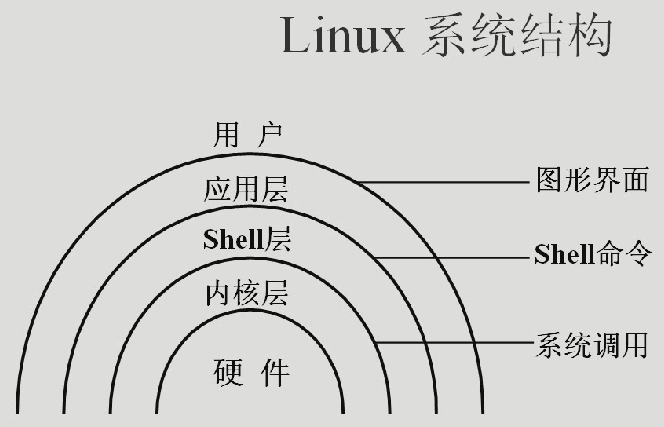

# Linux杂锦

## Linux系统结构

Linux系统结构从内到外分别是：硬件，内核，Shell层，应用层。

## Linux的应用方向

Linux一般有两个应用方向，分别是：**网络应用方向、嵌入式应用方向**。

在Linux的网络应用方向，有：

- 基于LAMP的网站论坛及B/S架构应用
- 基于Linux的负载均衡和集群
- 基于Linux的防火墙及代理服务器
- 基于Linux的网游服务器

Linux的嵌入式应用方向：

- 生物特征识别系统
- 智能卡系统
- 掌上电脑、手机等
- 路由器、机顶盒、数码相机等

## Linux中的文件命名规则

- 除了/之外，所有的字符都合法
- 有些字符最好不要用，如空格符、制表符等（反正是乱七八糟的符号都别用）
- 避免使用“.”作为普通文件名的第一个字符（因为在Linux中，以”.“开头的文件是隐藏文件）
- 大小写敏感

## 什么是 X Window

一般来说，Linux更多用于服务器环境中，并且使用命令行来操作，但是Linux也有图形化界面。其实X Window其实是一个图形化界面环境（协议），你可以根据这个协议开发出适合Linux的图形化界面，现在比较常用的基于X Window开发出的形化界面就有：CDE（Common Desktop Envirement，通用桌面环境）/KDE。

## Linux远程管理工具

Linux的远程管理工具有两种类型，分别是**命令行远程管理工具、图形化管理工具**。

- 命令行远程管理工具常用的有：Putty, SecireCRT；

- 图形化管理工具常用的有：VNC, Xmanager.

